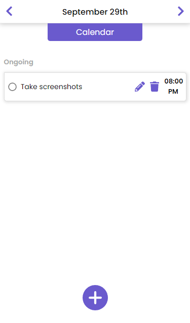
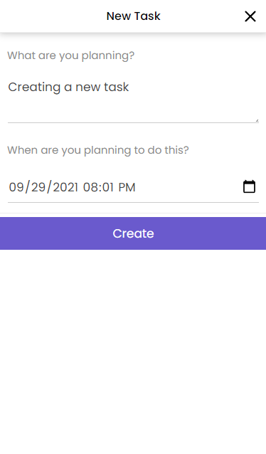
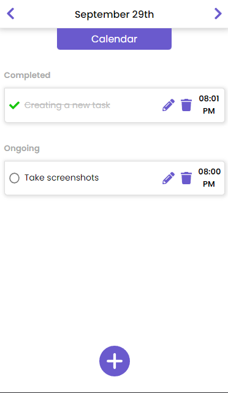
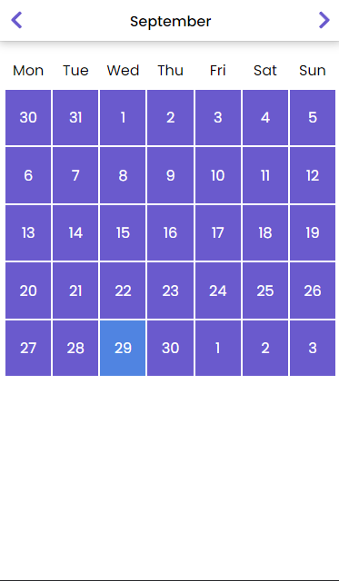

# TaskMaster

### About TaskMaster

TaskMaster is a task scheduling tool, created with the sole purpose of bringing structure into users life, one task at a time, in a sleek and professional jacket.

Upon loading the application, users will be shown the tasks for the current date. **(See screenshot 1)**  
Users can then click on the purple button at the bottom to add a new task to their list, the default selected date will be the current date and time so the user doesn't have to enter this himself. **(See screenshot 2)**  
Should the user have completed a task, they can change the status by clicking on the icon on the left of the title. **(See screenshot 3)**  
The user can also edit the title of their task or the date/time it has been scheduled on by clicking on the pencil icon, should it be desired a task can also be removed by clicking on the trashcan icon.  
Users can scroll ahead/back to other dates by using the arrows at the top left and right of the task-overview. Or if they need to look at a more specific date that will require a lot of scrolling, they can click on the 'Calendar' button to speed up this process.  
The current date will be highlighted, users can click on any date and the app will take them straight there. **(See screenshot 4)** 

 

### Getting started

**What you need:**

- Code editor (ex: VS Code)
- Web browser (ex: Google Chrome)
- Mongod (v5.0.2) installed on your machine (don't forget to launch the database service from your terminal).

**Application-wide:**

1. Open the project folder.
2. Run `npm i` in your terminal.

**Back end:**

1. Move into the server folder
2. Run `npm i` in your terminal.
3. Start the server by running `npx nodemon` in your terminal

**Front end:**

1. Move into the client folder
2. Run `npm i` in your terminal.
3. Start the application by running `npm start` in your terminal
4. Be sure to view the app in responsive mode, currently the only fully supported screen size is 375px.

### Tech stack

TaskMaster has been created using:   
**Front-end**: React as the framework and redux to manage the state 
**Back-end**: Express as the framework for the server and MongoDB for the database, using Mongoose as my ORM. 

### Closing statement

The app's current features are quite limited, it was built in 7 days as the final project to finish up the 8 week Web Development bootcamp I was in. The main focus of this project was to showcase the application, hence why I focused on styling and creating as many features as possible.
